# Blood Pressure for Home Assistant

A dashboard card for your blood pressure. It shows your latest reading and its category, the average of the period, and a chart of your readings: as bars, as lines, as daily averages, as separate charts per value, as a calendar, as a pie chart or as a gauge.

The colors follow a blood pressure guideline: the 2024 guidelines of the European Society of Cardiology by default, or the 2018 European or the 2017 American guidelines.

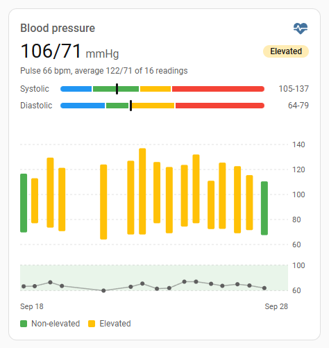

The card editor is available in English, Danish, German and Spanish.

## Install

Requires Home Assistant 2026.9 or newer.

### With HACS

Select this button to open the card in HACS, then select **Download**:

[](https://my.home-assistant.io/redirect/hacs_repository/?owner=mm98&repository=ha-blood-pressure&category=plugin)

Or add it yourself:

1. Open **HACS**, select the three dots at the top right and pick **Custom repositories**.
2. Enter `https://github.com/mm98/ha-blood-pressure`, choose the type **Dashboard** and select **Add**.
3. Search HACS for **Blood Pressure**, open it and select **Download**.
4. Reload the page in your browser.

### Without HACS

1. Copy `dist/blood-pressure.js` from this repository into the `www` folder of your Home Assistant configuration.
2. Go to **Settings > Dashboards**, select the three dots at the top right and pick **Resources**.
3. Select **Add resource**, enter `/local/blood-pressure.js`, choose **JavaScript module** and select **Create**.
4. Reload the page in your browser.

## What you need

Two sensors with your blood pressure in mmHg: one for the systolic (upper) and one for the diastolic (lower) value. A sensor with your pulse is optional. Blood pressure monitors that work with Home Assistant, like the ones of the [Withings integration](https://www.home-assistant.io/integrations/withings/), give you these sensors.

The chart shows the readings that Home Assistant's [recorder](https://www.home-assistant.io/integrations/recorder/) kept:

- The recorder keeps 10 days by default. To see a longer period, raise `purge_keep_days` in the recorder settings.
- Sensors left out of the recorder have no history. The card then shows only the latest reading.

## Add the card

Edit a dashboard, select **Add card** and pick **Blood pressure**. The card fills in the blood pressure and pulse sensors it finds. When you pick a blood pressure sensor in the card picker, the card is suggested with its other sensors filled in.

The card's editor has a field for every setting, so YAML is optional. It starts with the sensors, followed by sections for the chart, the parts to show and the colors:

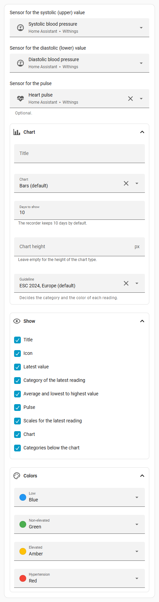

The same card in YAML:

```yaml
type: custom:blood-pressure
systolic: sensor.withings_systolic_blood_pressure
diastolic: sensor.withings_diastolic_blood_pressure
pulse: sensor.withings_heart_pulse
```

## Chart types

### Bars

The default. One bar per reading, from the diastolic up to the systolic value, in the color of its category. The pulse shows as a line below.


```yaml
type: custom:blood-pressure
systolic: sensor.withings_systolic_blood_pressure
diastolic: sensor.withings_diastolic_blood_pressure
pulse: sensor.withings_heart_pulse
```

### Lines

The systolic and the diastolic values as two lines, over faded bands where each value is neither low nor raised.

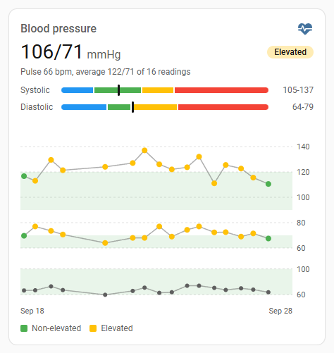

```yaml
type: custom:blood-pressure
systolic: sensor.withings_systolic_blood_pressure
diastolic: sensor.withings_diastolic_blood_pressure
pulse: sensor.withings_heart_pulse
chart_type: lines
```

### Daily averages

One point per day: the average of the day as a circle (systolic) and a diamond (diastolic), and the lowest to the highest value of the day as a thin line.

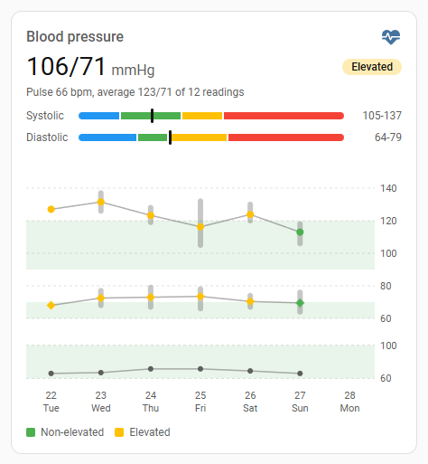

```yaml
type: custom:blood-pressure
systolic: sensor.withings_systolic_blood_pressure
diastolic: sensor.withings_diastolic_blood_pressure
pulse: sensor.withings_heart_pulse
chart_type: daily
days_to_show: 7
```

### Separate charts

The systolic value, the diastolic value and the pulse each in their own chart, over the faded band where the value is neither low nor raised, with the limit on the right. When a reading has several measurements, a short bar shows their lowest to highest value.

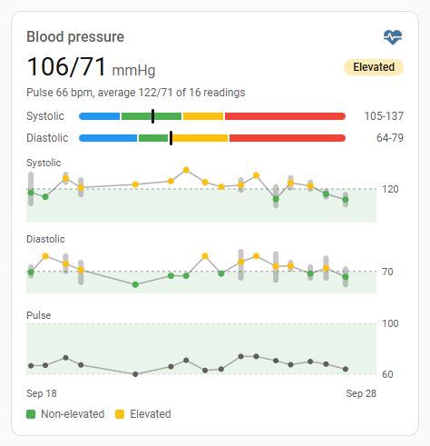

```yaml
type: custom:blood-pressure
systolic: sensor.withings_systolic_blood_pressure
diastolic: sensor.withings_diastolic_blood_pressure
pulse: sensor.withings_heart_pulse
chart_type: split
```

### Calendar

The last five weeks, one box per day in the color of that day's average. Days without a reading stay gray.

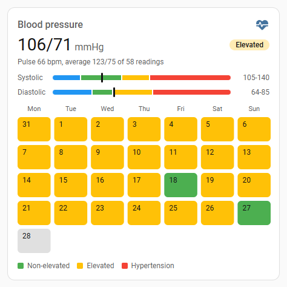

```yaml
type: custom:blood-pressure
systolic: sensor.withings_systolic_blood_pressure
diastolic: sensor.withings_diastolic_blood_pressure
pulse: sensor.withings_heart_pulse
chart_type: calendar
days_to_show: 35
```

### Pie chart

How many of your readings fell in each category.

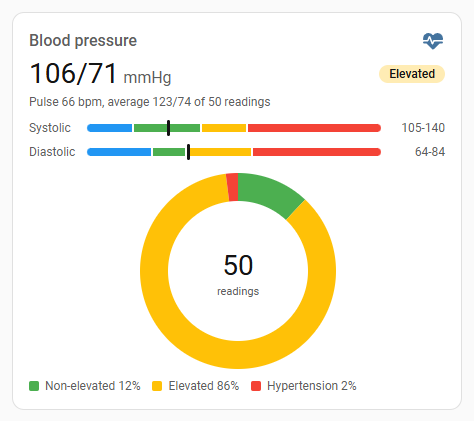

```yaml
type: custom:blood-pressure
systolic: sensor.withings_systolic_blood_pressure
diastolic: sensor.withings_diastolic_blood_pressure
pulse: sensor.withings_heart_pulse
chart_type: pie
days_to_show: 30
```

### Gauge

One gauge with a segment for each category. The needle points at the category of the latest reading, further into the segment the further the reading is into that category. The gauge names the category, the reading shows below it. It needs no history, so it also works for sensors the recorder leaves out.

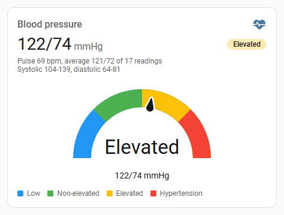

```yaml
type: custom:blood-pressure
systolic: sensor.withings_systolic_blood_pressure
diastolic: sensor.withings_diastolic_blood_pressure
pulse: sensor.withings_heart_pulse
chart_type: gauge
show_scales: false
```

## Colors

Every category has its own color. Pick another one in the editor's **Colors** section, or set it in `colors`: a Home Assistant theme color like `red`, `amber` or `purple`, or any color like `#8e24aa`. Categories you leave out keep their own color. The colors follow your theme.

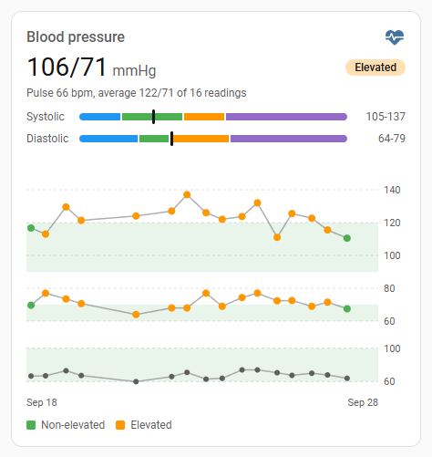

```yaml
type: custom:blood-pressure
systolic: sensor.withings_systolic_blood_pressure
diastolic: sensor.withings_diastolic_blood_pressure
pulse: sensor.withings_heart_pulse
chart_type: lines
colors:
  elevated: orange
  hypertension: purple
```

The categories of each guideline are listed below. Their names in `colors` are `low`, `non_elevated`, `elevated` and `hypertension` for `esc_2024`, `low`, `optimal`, `normal`, `high_normal`, `grade_1`, `grade_2` and `grade_3` for `esc_esh_2018`, and `low`, `normal`, `elevated`, `stage_1`, `stage_2` and `crisis` for `acc_aha_2017`.

## Height

Every chart type has a height of its own. Set `height` to make the chart taller or lower, in pixels. The chart keeps the width of the card, and its text and dots keep their size. For the gauge, `height` sets how big the gauge gets.

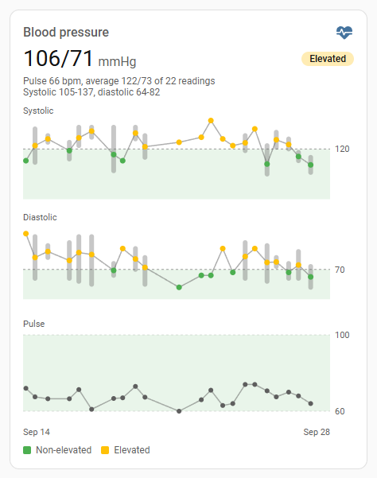

```yaml
type: custom:blood-pressure
systolic: sensor.withings_systolic_blood_pressure
diastolic: sensor.withings_diastolic_blood_pressure
pulse: sensor.withings_heart_pulse
chart_type: split
days_to_show: 14
height: 420
show_scales: false
```

## Fewer parts

Every part of the card can be turned off: the title, the icon, the latest value, its category, the average, the pulse, the scales, the chart and the categories below the chart.

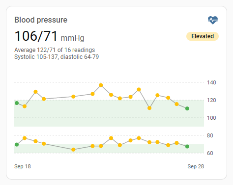

```yaml
type: custom:blood-pressure
systolic: sensor.withings_systolic_blood_pressure
diastolic: sensor.withings_diastolic_blood_pressure
pulse: sensor.withings_heart_pulse
chart_type: lines
show_scales: false
show_pulse: false
show_legend: false
```

## Guidelines

A reading gets the highest category that its systolic or its diastolic value reaches. Below the lowest category, a reading under 90 systolic or under 60 diastolic counts as low. All values in mmHg.

| `guideline` | Categories |
|---|---|
| `esc_2024` (default) | Non-elevated: below 120 and below 70. Elevated: 120 to 139, or 70 to 89. Hypertension: 140 or more, or 90 or more. |
| `esc_esh_2018` | Optimal: below 120 and below 80. Normal: 120 to 129, or 80 to 84. High normal: 130 to 139, or 85 to 89. Grade 1: 140 to 159, or 90 to 99. Grade 2: 160 to 179, or 100 to 109. Grade 3: 180 or more, or 110 or more. |
| `acc_aha_2017` | Normal: below 120 and below 80. Elevated: 120 to 129, and below 80. Stage 1: 130 to 139, or 80 to 89. Stage 2: 140 or more, or 90 or more. Hypertensive crisis: above 180, or above 120. |

The colors show the category of a reading, not a diagnosis. The targets your doctor gave you come first.

## Settings

| Setting | What it does |
|---|---|
| `systolic` | The sensor with your systolic (upper) value. Required. |
| `diastolic` | The sensor with your diastolic (lower) value. Required. |
| `pulse` | The sensor with your pulse. Optional. |
| `title` | The title at the top of the card. `Blood pressure` by default, in the language of your user profile. |
| `chart_type` | `bars` (default), `lines`, `daily`, `split`, `calendar`, `pie` or `gauge`. |
| `days_to_show` | How many days the chart and the average cover. 10 by default. |
| `height` | The height of the chart in pixels. By default each chart type has its own height. |
| `guideline` | `esc_2024` (default), `esc_esh_2018` or `acc_aha_2017`. See **Guidelines** below. |
| `colors` | Another color for some categories, like `elevated: orange`. See **Colors** above. |
| `show_title`, `show_icon` | The title and the icon at the top. |
| `show_state` | The latest value. |
| `show_category` | The category of the latest value. |
| `show_average` | The average of the period, and the lowest to the highest value. |
| `show_pulse` | The latest pulse, and the pulse below the chart. Needs `pulse`. |
| `show_scales` | The scales with the categories of the systolic and the diastolic value, and a mark at the latest value. |
| `show_chart` | The chart or the gauge. |
| `show_legend` | The categories below the chart. |

Every `show_` setting is `true` by default. Set it to `false` to leave that part out.

## Good to know

- Measurements taken within 10 minutes of each other count as one reading with their average, the way doctors count them. Many monitors take two or three in a row.
- The average covers the readings of the period of the chart. Each sitting counts once.
- The pulse band shows 60 to 100 bpm, the usual resting pulse of adults.
- The European guidelines compare the average of a week of home readings with 135/85, which is lower than the 140/90 used at the doctor's.

To build the card yourself or add a language, see [CONTRIBUTING.md](CONTRIBUTING.md).
